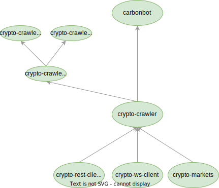

# crypto-crawler-rs

==========

A rock-solid cryprocurrency crawler.

## Quickstart

Use the [carbonbot](https://github.com/crypto-crawler/carbonbot) binary to crawl data.

If you need more control and customization, use this [crypto-crawler](./crypto-crawler) library.

## Architecture

- [crypto-crawler](./crypto-crawler) is the crawler library to crawl websocket and restful messages from exchanges
- [carbonbot](https://github.com/crypto-crawler/carbonbot) is the main CLI tool to run crawlers.
- [crypto-ws-client](./crypto-ws-client) is the underlying websocket client library, providing a set of universal APIs for different exchanges.
- [crypto-rest-client](./crypto-rest-client) is the underlying RESTful client library, providing universal APIs to get public data from different exchanges.
- [crypto-markets](./crypto-markets) is a RESTful library to retreive market meta data from cryptocurrency echanges.
- [crypto-client](./crypto-client) is a RESTful client library to place and cancel orders.
- Support multiple languages. Some libraries support multiple languages, which is achieved by first providing a FFI binding, then a languge specific wrapper. For example, `crypto-crawler` provides a C-style FFI binding first, and then provides a Python wrapper and a C++ wrapper based on the FFI binding.

## How to parse raw messages

Use the [crypto-msg-parser](https://github.com/crypto-crawler/crypto-msg-parser) library to parse raw messages.

Crawlers should always preserve the original data without any parsing.
